# LAB 2 : Rooting Android

# Step 1 : Configuration et activation du mode root sur l’AVD :
1. Demarrer le serveur ADB avec privilege root et remonter en mode lecture et ecriture.

<p align="center"> 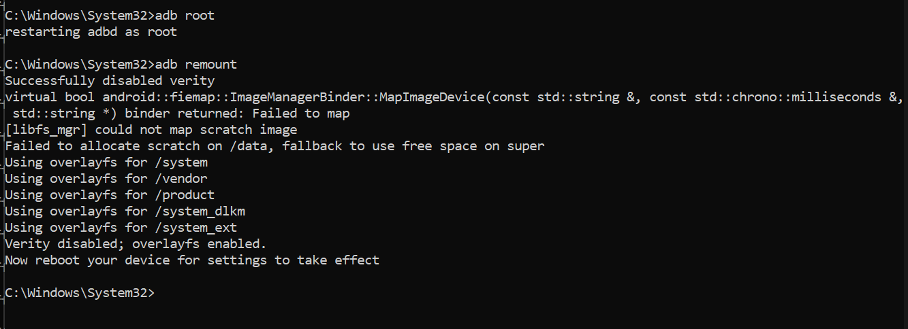 </p>

2. Verification:
<p align="center"> 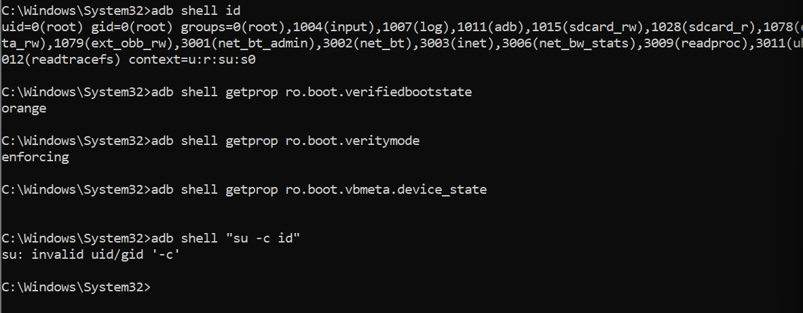 </p>
<p align="center"> 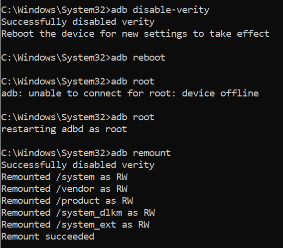 </p>

3. Journalisation:
<p align="center"> 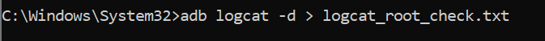 </p>
<p align="center"> 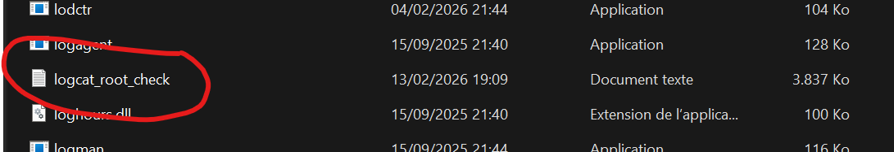 </p>

# Step 2 : Définition du périmètre de test (fiche synthétique):

Application + version : DIVA (Damn Insecure and Vulnerable App) 
<p align="center"> 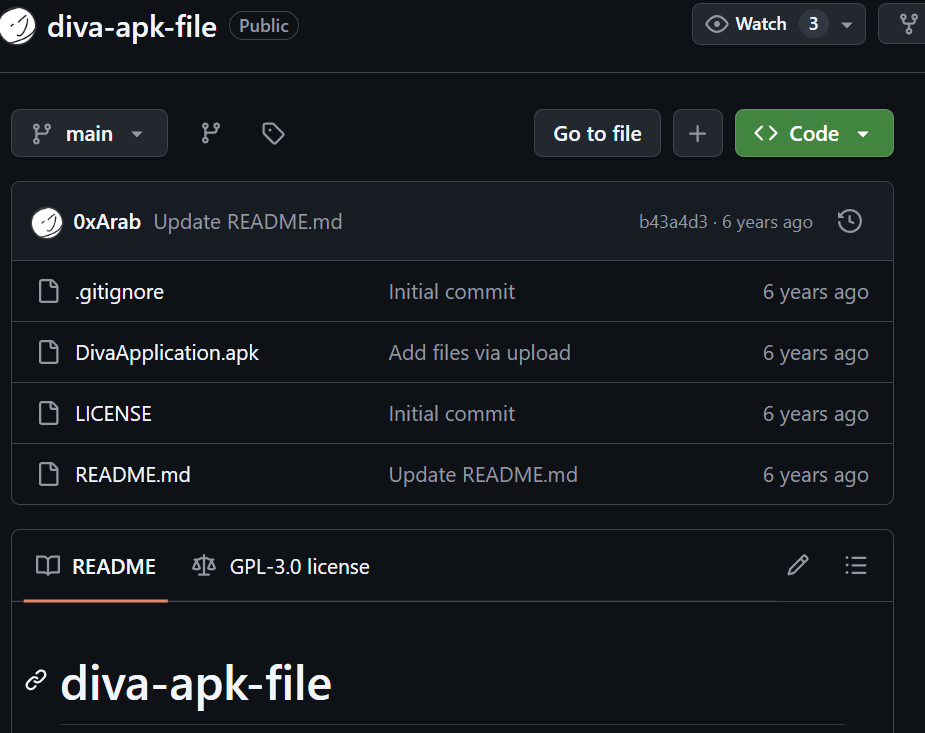 </p>
– version installée sur l’AVD 
<p align="center"> 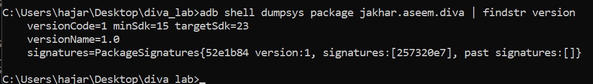 </p>

Support : Émulateur Android - AVD Pixel_6 

Objectif : Comprendre le rooting et analyser ses impacts sur la sécurité de l’application

Données utilisées : Données fictives / environnement de test uniquement

Réseau : Réseau de test isolé (aucune interaction avec un environnement réel)

# Step 3: Démarrer un AVD propre:

<p align="center"> 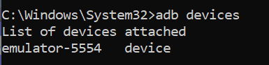 </p>
<p align="center">  </p>

# Step 4:  Installer et lancer l'app :
<p align="center"> 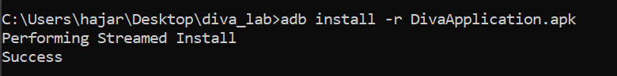 </p>
<p align="center"> 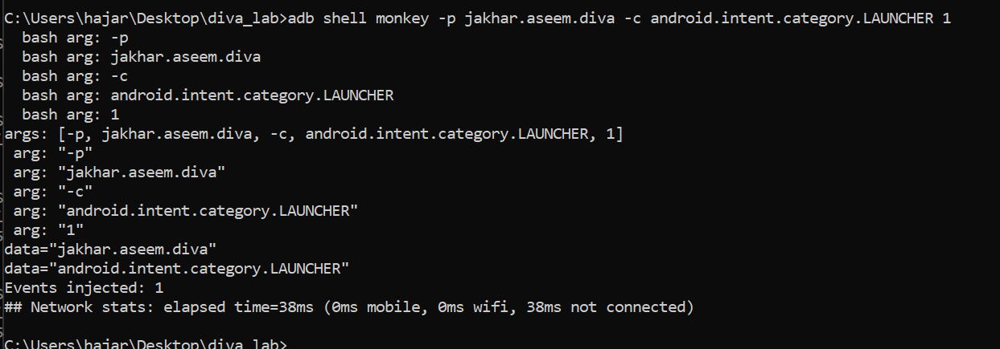 </p>
<p align="center"> 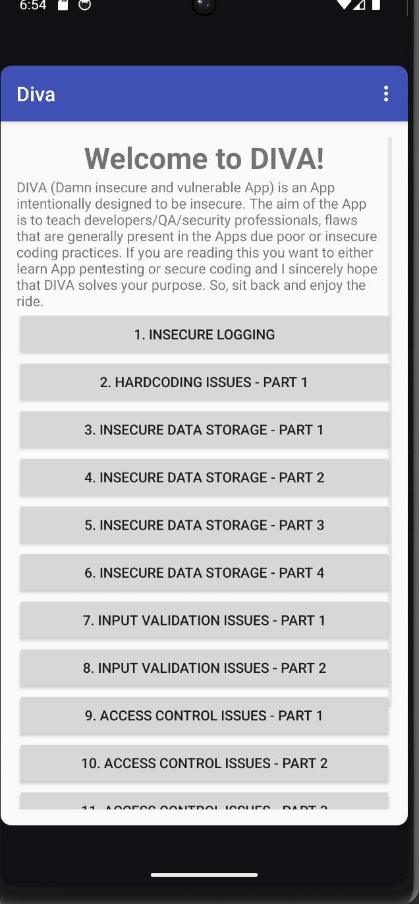 </p>

# Step 5: Définir 3 scénarios :
##DIVA – Scénarios de test (ADB)
1. Scénario 1 — Ouvrir l’application Diva (Écran d’accueil)
##Objectif: Lancer DIVA et afficher l’écran principal.

-Revenir au Home Android:
<p align="center">  </p>

-Lancer l’application 
<p align="center"> 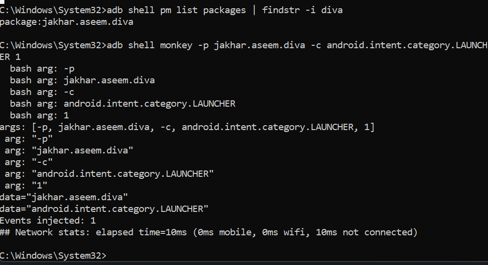 </p>

-L’écran principal de DIVA s’affiche avec la liste des modules.
<p align="center"> 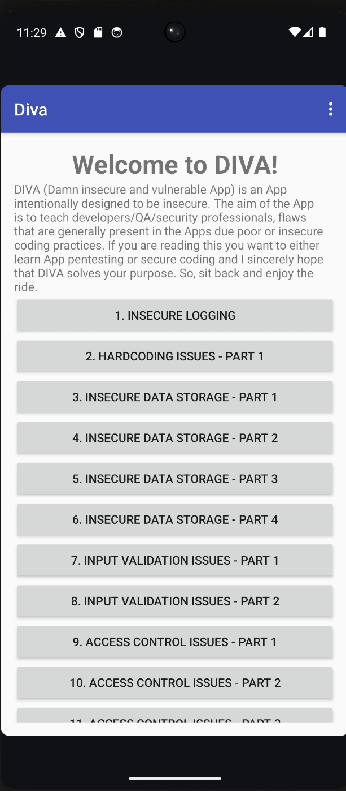 </p>

2. Scénario 2 — Rechercher un item 
##Objectif : ouvrir la recherche et taper un texte toujours identique.
<p align="center"> 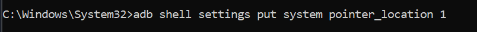 </p>
<p align="center"> 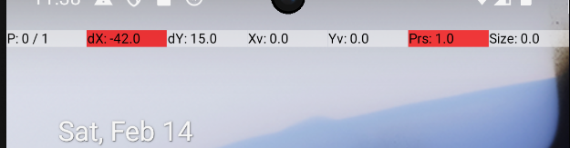 </p>
-Ouvrir la recherche:
<p align="center"> 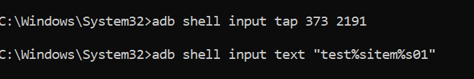 </p>

-Taper le texte exact:
<p align="center"> 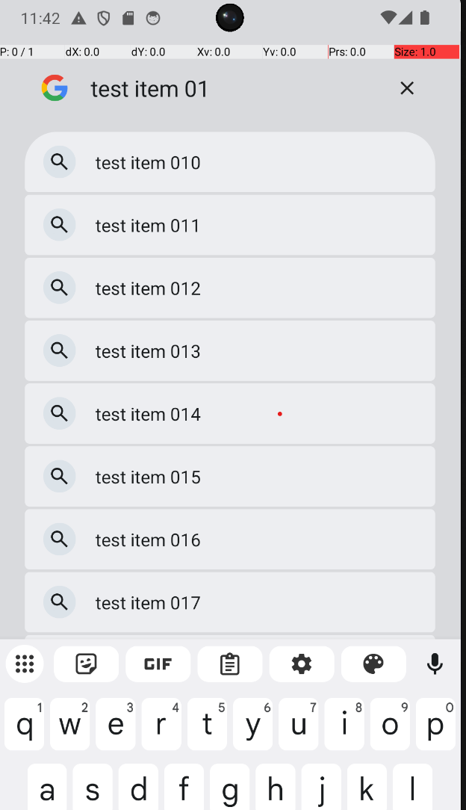 </p>

-Valider (Entrée):
<p align="center">  </p>
<p align="center">  </p>

3. Scénario 3 — Ouvrir une fiche détail et revenir:

##Objectif:Accéder à un LAPPLICATION  ET CHOISIR UN ITEM  puis revenir en arrière.

-Pour cliquer sur un item detail de lapplication :
<p align="center"> 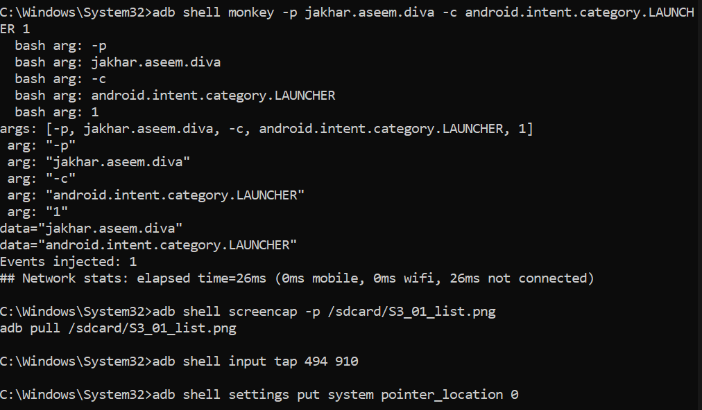 </p>

-Revenir en arriere:
<p align="center">  </p>

-L’écran détail s’affiche et Le bouton "Back" ramène à la liste principale


# Step 6:  Synthèse des fondements de la sécurité Android:

La sécurité Android repose sur plusieurs couches de protection.
Chaque application fonctionne dans une sandbox, ce qui signifie qu’elle est isolée des autres (comme une salle de classe fermée).
Le modèle de permissions contrôle l’accès aux ressources sensibles (caméra, stockage, micro), comme demander l’autorisation au professeur avant d’utiliser du matériel.
Le système garantit aussi l’intégrité globale, empêchant les modifications non autorisées du système.
Le rooting peut contourner ces protections en donnant un accès privilégié au système.
Comprendre ces couches aide à analyser les risques liés à la sécurité Android.

# Step 7:  Compréhension et vérification de Verified Boot :
## Verified Boot — Principe et Vérification:
Verified Boot est un mécanisme de sécurité qui contrôle l’intégrité du système dès le démarrage de l’appareil.
Son rôle est de s’assurer que le système chargé au boot n’a pas été altéré ou modifié de manière non autorisée.
On peut l’imaginer comme un contrôle d’identité effectué à l’entrée d’un bâtiment avant d’autoriser l’accès.
## Notion de Chain of Trust:
La chain of trust correspond à une succession de vérifications où chaque composant valide le suivant avant de lui transmettre l’exécution.
Si un maillon de cette chaîne échoue, la confiance est rompue et le système peut signaler un problème.
## Pourquoi l’intégrité au démarrage est essentielle ?
Le démarrage est la base de tout le système.
Si cette étape est compromise, les mécanismes de sécurité chargés ensuite peuvent être contournés, car ils reposent sur un socle déjà altéré.

-Commande de vérification :
<p align="center"> 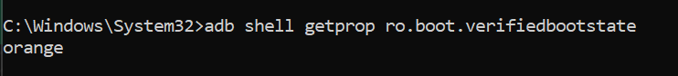 </p>
### Orange : Système modifié ou bootloader déverrouillé

# Step 8 : Présentation d’Android Verified Boot (AVB):

## Android Verified Boot (AVB):
AVB est l’évolution moderne de Verified Boot (version 2.0), conçue pour offrir un contrôle d’intégrité plus robuste et plus flexible.
Il vérifie cryptographiquement les partitions du système afin de s’assurer qu’aucune modification non autorisée n’a été effectuée.
AVB intègre également une protection contre le rollback, empêchant l’installation d’anciennes versions vulnérables du système.

## Protection Anti-Rollback:
La protection anti-rollback bloque l’installation d’une version plus ancienne du système si celle-ci contient des failles connues.
Cela évite qu’un attaquant ne remplace une version sécurisée par une version plus faible pour exploiter ses vulnérabilités.
C’est comparable à empêcher le remplacement d’une serrure récente et sécurisée par un ancien modèle plus facile à forcer.

# Step 9 : Explication du  rooting:

##Définition du Rooting:
Le rooting consiste à obtenir les privilèges de super-utilisateur sur un appareil Android.
Cela modifie le niveau de confiance du système et contourne certaines protections de sécurité mises en place par défaut.
En laboratoire, le root est utile pour analyser le comportement interne d’une application ou du système.
Cependant, il comporte des risques importants et doit être réalisé dans un environnement isolé avec traçabilité et possibilité de réinitialisation.

# Step 10: Intérêt du Rooting en Laboratoire 
En laboratoire, un environnement privilégié peut aider à observer des artefacts système normalement inaccessibles.
Il permet également d’analyser les comportements runtime d’une application à un niveau plus bas que les permissions standards.
Cela aide à tester la robustesse du stockage face à un attaquant disposant de privilèges élevés.
Par exemple, avec un accès root, il est possible d’examiner comment une application protège ses données sensibles : repose-t-elle uniquement sur l’isolation du système (mauvaise pratique) ou implémente-t-elle son propre chiffrement (bonne pratique) ?


# Step 11 : Matrice de Risques : 

-Intégrité non garantie → Peut fausser l’analyse et produire des conclusions biaisées sur la sécurité réelle de l’application.

-Surface d’attaque accrue hors labo → Un appareil rooté exposé à l’extérieur augmente les risques d’exploitation.

-Données sensibles présentes → Risque de violation de confidentialité si des informations réelles sont utilisées.

-Instabilité système → Peut rendre les tests non reproductibles et générer des résultats incohérents.

-Mélange comptes personnels / test → Possibilité de fuite ou d’exposition de données privées.

-Nettoyage insuffisant après tests → Persistance de données sensibles sur l’appareil.

-Réseau non isolé → Impact involontaire possible sur d’autres systèmes connectés.

-Traçabilité insuffisante → Difficulté à reproduire, vérifier ou auditer les expérimentations réalisées.


# Step 12 : Mesures Défensives :

-Réseau isolé : Utiliser un réseau dédié afin d’éviter toute communication non contrôlée avec des systèmes externes.

-Données fictives uniquement : Employer exclusivement des données de test pour éliminer tout risque de fuite d’informations réelles.

-Appareil / AVD dédié : Réserver le device ou l’émulateur uniquement aux tests de sécurité pour éviter toute contamination croisée.

-Snapshots ou réinitialisation : Effectuer un snapshot ou un wipe en fin de séance afin de ne laisser aucune trace persistante.

-Journal de configuration : Maintenir une documentation détaillée de l’environnement pour garantir la reproductibilité des tests.

-Aucun compte personnel : Interdire l’usage de comptes privés pour éviter tout mélange ou exposition de données.

-Contrôle des APK installées : Installer uniquement les applications nécessaires et vérifiées pour limiter la surface d’attaque.

-Horodatage et captures : Conserver des preuves datées (captures, logs) pour assurer une traçabilité complète des manipulations.


# Step 13 : OWASP MASVS :

L’OWASP (Open Web Application Security Project) est une organisation internationale spécialisée en sécurité applicative.
Le MASVS (Mobile Application Security Verification Standard) est un référentiel qui définit les bonnes pratiques de sécurité pour les applications mobiles.

## STORAGE-1 — Stockage sécurisé:
Les données sensibles (API keys, mots de passe, tokens, informations personnelles) doivent être stockées de manière sécurisée en utilisant des mécanismes de chiffrement adaptés.
Une application ne doit jamais s’appuyer uniquement sur l’isolation du système pour protéger ses données critiques.

## NETWORK-1 — Communications sécurisées:
Toutes les communications réseau doivent utiliser TLS correctement configuré et vérifier les certificats du serveur.
Cela empêche les attaques de type interception (Man-in-the-Middle).

# Step 14 : OWASP MASTG :

## OWASP MASTG — Idées de Tests :
Le MASTG (Mobile Application Security Testing Guide) complète le MASVS.
Si le MASVS définit quoi vérifier, le MASTG explique comment effectuer les tests concrètement.
Il sert de guide pratique pour analyser la sécurité d’une application mobile.


## 2 Idées de test :

1. Test stockage local :
Objectif : vérifier si des données sensibles sont stockées en clair.
Méthode : examiner les fichiers dans /data/data/[package]/shared_prefs/.

2. Test logs applicatifs:
Objectif : vérifier si des données sensibles apparaissent dans les logs.
Méthode : analyser les logs avec adb logcat.

 
## Step 16 : Traçabilité :

-Fiche Environnement:

--Informations générales

Date : 12/02/2025

Auteur : Chaira Hajar

Support : AVD Pixel_6 (Environnement laboratoire)

Version Android / API : Android 14 – API 34

Application testée : DIVA – Version 1.0

-- Scénarios exécutés

Ouverture de l’application (écran principal affiché)

Ouverture d’un module spécifique via interaction ADB

Accès écran détail + retour arrière

 --Observations factuelles

1. L’application se lance correctement via adb monkey.

2. La commande adb root [succès / échec selon ton cas].

3. L’état de Verified Boot.

4. Les interactions ADB (tap, back) fonctionnent comme prévu.


 --Limites identifiées

1. Environnement rooté pouvant modifier le comportement réel de sécurité.

2. Tests réalisés uniquement sur émulateur (pas device physique).

3. Données fictives utilisées, pas de cas réel complexe.

--Réinitialisation

Reset effectué : Oui / Non

Méthode :  Wipe AVD

Preuve : Capture ou log confirmant l’état propre après reset


## Step 17 :  Remise à Zéro de l’AVD :

La réinitialisation de l’émulateur est une étape essentielle pour garantir un environnement propre et éviter toute contamination des tests futurs.

<p align="center"> 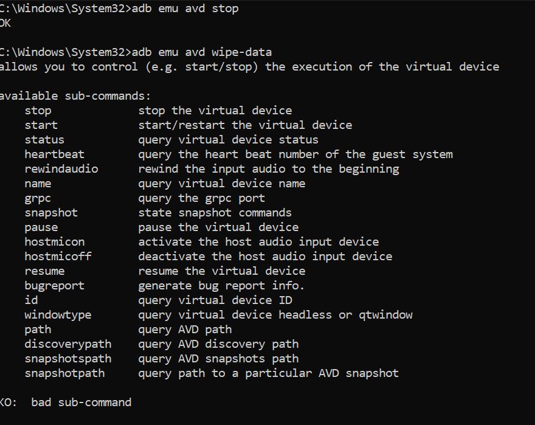 </p>


## Step 19: Rapport:

#  Android Security Lab – Analyse DIVA

---

##  1. Définition du Rooting

Le rooting consiste à obtenir les privilèges super-utilisateur sur un appareil Android.  
Il permet d’accéder aux zones du système normalement protégées par le modèle de sécurité.  
Cela modifie le niveau de confiance de l’appareil et peut contourner certaines protections natives.  
En laboratoire autorisé, il est utile pour l’analyse de sécurité, mais reste risqué hors environnement contrôlé.

---

##  2. Verified Boot & AVB (Chaîne de Confiance)

### Objectif
Garantir que le système qui démarre est authentique et non modifié.

### Schéma simplifié

```
Boot ROM
   ↓ vérifie
Bootloader
   ↓ vérifie
VBMeta (AVB)
   ↓ vérifie
Partitions système (boot, system, vendor...)
```

Chaque composant vérifie cryptographiquement le suivant avant exécution.  
En cas d’échec → avertissement ou blocage du démarrage.

---

##  3. Matrice de Risques

| Risque | Mesure Défensive |
|--------|------------------|
| Intégrité système non garantie | Image propre + documentation état initial |
| Surface d’attaque accrue | Usage strictement limité au labo |
| Données sensibles exposées | Utilisation de données fictives uniquement |
| Instabilité système | Réinitialisation AVD après chaque séance |
| Mélange comptes perso/test | Comptes dédiés aux tests |
| Nettoyage insuffisant | Wipe obligatoire fin de session |
| Réseau non isolé | Réseau de test contrôlé |
| Manque de traçabilité | Captures horodatées + journal détaillé |

---

##  4. Mesures Défensives

- Réseau isolé  
- AVD dédié aux tests  
- Aucun compte personnel  
- Contrôle strict des APK installées  
- Snapshot ou wipe en fin de séance  
- Journal de configuration maintenu  
- Captures avec annotation  
- Vérification de l’état système avant/après tests  

---

## 5. OWASP MASVS – Exigences Sélectionnées

### STORAGE-1
Les données sensibles (API keys, mots de passe, tokens) doivent être stockées de manière sécurisée via des mécanismes de chiffrement appropriés.

### NETWORK-1
Les communications réseau doivent doivent utiliser TLS correctement configuré avec validation des certificats.

---

## 6. OWASP MASTG – Idées de Tests

###  Test 1 : Inspection du stockage local
Vérifier le dossier :

```
/data/data/[package]/shared_prefs/
```

Objectif : détecter la présence de données sensibles en clair.

###  Test 2 : Analyse des logs
```
adb logcat
```

Objectif : identifier d’éventuelles fuites d’informations sensibles pendant l’exécution.

---

## 7. Fiche Environnement

- **Date :** 12/02/2025  
- **Auteur :** Chaira Hajar  
- **Support :** AVD Pixel_6  
- **Android / API :** [14 + 34]  
- **Application :** DIVA – v1.0  

### Scénarios exécutés
1. Lancement application  
2. Ouverture module  
3. Accès écran détail + retour  

### Observations factuelles
- `adb root` → [Résultat]  
- `ro.boot.verifiedbootstate` → [green/orange/etc.]  
- Interactions ADB fonctionnelles  

### Limites
- Environnement émulateur uniquement  
- Données fictives  
- Root modifie le modèle de confiance réel  

---

##  8. Checklist Reset (Fin de Séance)

| Élément | Statut |
|----------|--------|
| Wipe Data effectué | checked |
| Assistant Android visible | checked |
| Aucune application installée | checked |
| Captures archivées | checked |


---

##  Conclusion

Le rooting modifie profondément le modèle de sécurité Android.  
Verified Boot et AVB assurent l’intégrité du système via une chaîne de confiance.  
Un environnement de test doit être isolé, documenté et réinitialisé afin de garantir la fiabilité et la reproductibilité des analyses.


